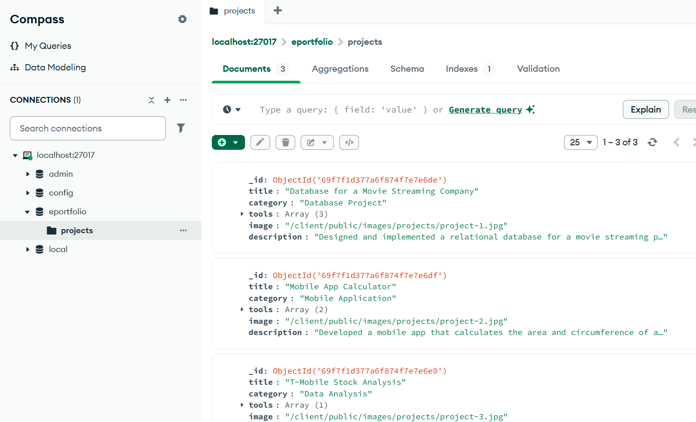
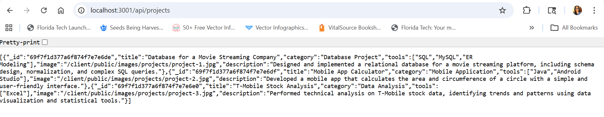
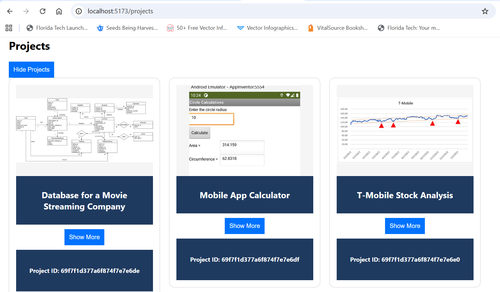

# React + Vite

This template provides a minimal setup to get React working in Vite with HMR and some ESLint rules.

Currently, two official plugins are available:

- [@vitejs/plugin-react](https://github.com/vitejs/vite-plugin-react/blob/main/packages/plugin-react) uses [Oxc](https://oxc.rs)
- [@vitejs/plugin-react-swc](https://github.com/vitejs/vite-plugin-react/blob/main/packages/plugin-react-swc) uses [SWC](https://swc.rs/)

## React Compiler

The React Compiler is not enabled on this template because of its impact on dev & build performances. To add it, see [this documentation](https://react.dev/learn/react-compiler/installation).

## Expanding the ESLint configuration

If you are developing a production application, we recommend using TypeScript with type-aware lint rules enabled. Check out the [TS template](https://github.com/vitejs/vite/tree/main/packages/create-vite/template-react-ts) for information on how to integrate TypeScript and [`typescript-eslint`](https://typescript-eslint.io) in your project.

## External API added
The project now interacts with an external API (https://official-joke-api.appspot.com/random_joke) which provides a random joke to give a sense of humor to my profile.

## New endpoints
Default backend server has been set to http://localhost:3001.
To test new endpoints (/projects, /contact), you may access http://localhost:3001/api/projects and http://localhost:3001/api/contact respectively. However, since /contact is a POST endpoint, you will not be able to test it through Chrome or Edge, you will need an external party software to do so. You can test both through the frontend application (http://localhost:5173/projects and http://localhost:5173/contact).
Additionally, you may also test the joke generator through http://localhost:3001/api/joke.

## Running both front-end and back-end
'concurrently' has been added to npm so that you can run front-end and back-end (server.js) of the project with one command: 'npm run dev'.

## Purpose of back-end
This backend server was built using Node.js and Express.js to support my React ePortfolio. It handles API requests, serves JSON data, validates form submissions, and integrates with the frontend to create a full-stack (MERN-style) application.

## Setup and updates
The front-end is built using React and is located in the /client directory, while the back-end is built using Node.js, Express, and MongoDB (via Mongoose) and is located in the /server directory. The application has been updated so that project data is no longer hardcoded in JSON but is now dynamically retrieved from MongoDB through the backend API endpoint http://localhost:3001/api/projects, which is configured in the /server directory. The backend uses Mongoose to query the MongoDB database and return project data through this endpoint, and the React front-end running at http://localhost:5173 fetches this data and uses it to render projects dynamically using the ProjectCard component.
As before, to run the project you can input 'npm install' to install the necessary packages into node_modules, and then input 'npm run dev', package.json has been updated to properly run both projects with this command.
For more information on changes on the back-end application, refer to /server/README.md.

MongoDB projects:

Back-end projects endpoint:

Front-end projects endpoint:
